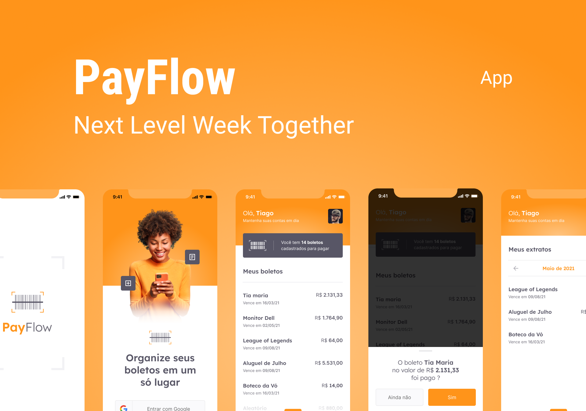

# PayFlow

O PayFlow contém recursos como o uso de câmera e galeria, Machine Leaning com MLKit, Firebase Core e SignIn, Animações e Estilizações Personalizadas, entre vários outros pontos, como o uso do SharedPreferences.

## Layout

 
 

O layout foi desenvolvido por [Tiago Luchtenberg](https://www.instagram.com/tiagoluchtenberg/), e você pode acessá-lo no Figma: [Layout](https://www.figma.com/file/kLK7FYnWKMoN68sQXcSniu/PayFlow)

## Features implementadas

- Realizar login com Google;

## Como executar?

- Clone o repositório;
- Entre na pasta do projeto;
- Execute `pub get` para instalar todas as dependências do projeto;
- Inicie um emulador de dispositivo móvel ou conecte seu smartphone no computador (certifique-se que seu aparelho tenha a Depuração USB ativada);
- Execute `flutter run` para executar o aplicativo no seu dispositivo conectado (ou emulado).
- E pronto, o aplicativo estará executando no seu celular.

## Observações

- O projeto está rodando na versão 2.3.0 do Flutter e na versão 2.14.0 do Dart;
- Apesar do aplicativo rodar em ambas plataformas (Android e iOS), esse projeto foi todo testado apenas em aparelhos Android.
